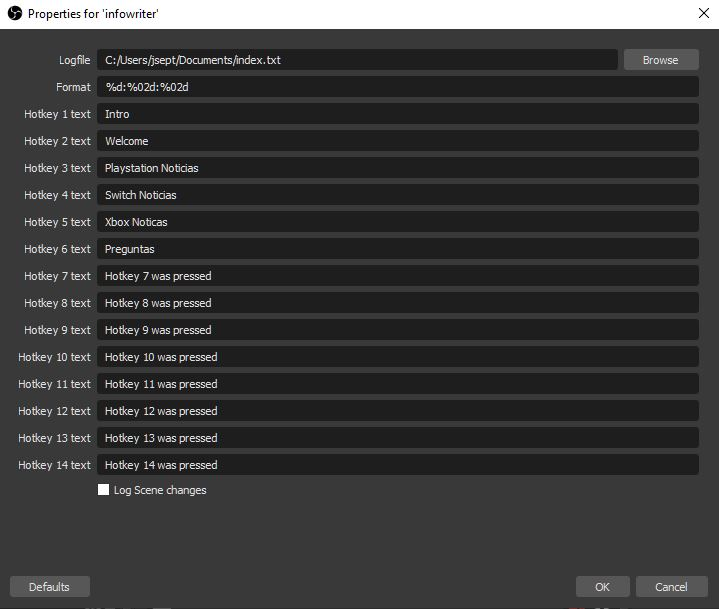

# OBSInfoWriter

Multiplatform version of ObsInfoPlugin to write timestamps to a file.

Plugin thread on the OBS forums: https://obsproject.com/forum/resources/infowriter.345/

For the original OBS-classic version, go to https://github.com/partouf/ObsInfoPlugin

-----

## Installation

### Windows
- Place the 64bit **OBSInfoWriter.dll** in your \obs-studio\obs-plugins\64bit folder
- Place the 32bit dll file in your \obs-studio\obs-plugins\32bit folder

### Linux
- Place the **libOBSInfoWriter.so** file into the `~/.config/obs-studio/plugins/OBSInfoWriter/bin/64bit/` folder
  - Note: the section "~/" indicates your _home folder_

### MacOSX
- Right-click on OBS in Applications and choose "Show package contents"
- Place the **libOBSInfoWriter.so** file (from the libOBSInfoWriter.OSX.zip file) in the plugins folder

## Configuration
- Add the InfoWriter Source to 1 scene (the scene doesn't have to be always active).
- Configure the Source and select the text file where you want the timestamps to be written to.
  
- Set the hotkeys you want to use in File -> Settings -> Hotkeys
  

#### Filename formatting options
You can name a Logfile to be saved with variables that may change every time you start a recording or stream. You can name your logfile for example: "C:\temp\recording %Y%m%d.txt" to tell InfoWriter to name your file "recording 20180204.txt" when it's the 4th of February 2018.
More variables can be found at http://www.cplusplus.com/reference/ctime/strftime/

#### Format options
The format option is very limited in it's use, the variables in the formatting are translated to hours:minutes:seconds from when the recording or stream was started, %02d is only to indicate that there is a preceding 0 for the numbers 0 to 9.
It is recommended the default value is not changed.

What is possible that might improve logging is that you can put spaces or a \t tab character in front of the format, so your log times are indented in between the start and stop of the recording or stream.

## More hotkeys

Contributed by https://github.com/RetroGamer74

